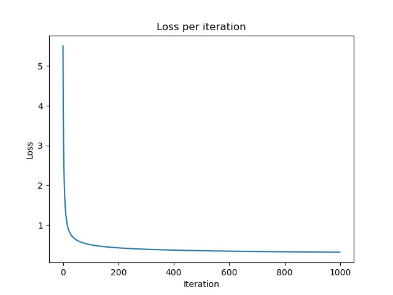
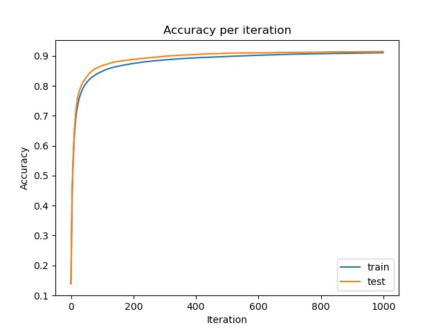

# Exercise1 - Softmax Regression 实验报告

> 武桐西 2112515

## 问题分析

本实验要求使用 Softmax Regression 实现对 MNIST 手写数字的识别。

本实验是一个**多分类**任务，数据集采用 [MNIST](http://yann.lecun.com/exdb/mnist/) 数据集，需要训练一个多分类的分类器，使其能够正确分类 $0 - 9$ 这 $10$ 个手写数字。

模型采用 Softmax Regression 模型。

## 实验原理

### Logistic Regression

Logistic Regression 虽然名为 Regression（回归），但实际上是用于分类问题的模型（主要是**二分类**问题）。

#### 1. 假设函数（Hypothesis Function）

逻辑回归的假设函数是一个sigmoid函数（也称为逻辑函数），它能够将任意的实数映射到一个范围在0和1之间的值。sigmoid函数的数学表达式为：
$$
h_\theta(x) = \frac{1}{1 + e^{-\theta^T x}}
$$
其中：

- $h_\theta(x)$ 是预测的概率，表示实例属于正类别的概率。
- $\theta$ 是模型的参数向量。
- $x$ 是输入特征向量。

#### 2. 损失函数（Cost Function）

逻辑回归使用的损失函数是交叉熵损失函数（Cross-Entropy Loss），也称为对数损失函数。损失函数的目标是最小化预测值与实际标签之间的差异。对于单个训练样本，损失函数的表达式为：
$$
J(\theta) = -y \log(h_\theta(x)) - (1 - y) \log(1 - h_\theta(x))
$$
其中：
- $J(\theta)$ 是损失函数。
- $y$ 是实际标签（0或1）。
- $h_\theta(x)$ 是模型的预测概率。

为了将整个训练集的损失表示，通常取所有样本的平均值：
$$
J(\theta) = -\frac{1}{m} \sum_{i=1}^{m} \left[ y^{(i)} \log(h_\theta(x^{(i)})) + (1 - y^{(i)}) \log(1 - h_\theta(x^{(i)})) \right]
$$

#### 3. 参数更新（梯度下降）

通过最小化损失函数来求解模型的参数。梯度下降是一种常用的优化算法。对于逻辑回归，梯度下降的迭代规则为：
$$
\theta_j := \theta_j - \alpha \frac{\partial J(\theta)}{\partial \theta_j}
$$
其中：
- $\alpha$ 是学习率，用于控制参数更新的步长。
- $\frac{\partial J(\theta)}{\partial \theta_j}$ 是损失函数对参数 $\theta_j$ 的偏导数。

对损失函数进行偏导数的计算，得到梯度下降的更新规则：
$$
\theta_j := \theta_j - \alpha \frac{1}{m} \sum_{i=1}^{m} (h_\theta(x^{(i)}) - y^{(i)})x_j^{(i)}
$$

#### 4. 正则化（Regularization）

为了防止过拟合，逻辑回归通常使用L1正则化或L2正则化。正则化项添加到损失函数中，目标是使模型的参数趋于较小的值。正则化损失函数为：
$$
J(\theta) = -\frac{1}{m} \sum_{i=1}^{m} \left[ y^{(i)} \log(h_\theta(x^{(i)})) + (1 - y^{(i)}) \log(1 - h_\theta(x^{(i)})) \right] + \frac{\lambda}{2m} \sum_{j=1}^{n} \theta_j^2
$$
其中 $\lambda$ 是正则化参数，控制正则化的强度。

### Softmax Regression

Softmax Regression 实际上是上述 Logistic Regression 的**多分类问题**的推广，使其不局限于二分类。在Softmax回归中，我们将模型的输出通过Softmax函数转化为多个类别的概率分布。

#### 1. Softmax函数

Softmax函数用于将模型的原始输出转化为类别概率分布。对于给定的输入向量 $z = [z_1, z_2, \ldots, z_k]$，Softmax函数的定义如下：
$$
\text{Softmax}(z)_i = \frac{e^{z_i}}{\sum_{j=1}^{k} e^{z_j}}
$$
其中：

- $\text{Softmax}(z)_i$ 是第 $i$ 个类别的概率。
- $e$ 是自然对数的底。

Softmax函数的输出是一个包含所有类别概率的向量，且概率之和为1。

#### 2. 假设函数

Softmax回归的假设函数为：
$$
h_\theta(x)_i = \text{Softmax}(\theta^T x)_i
$$
其中：
- $h_\theta(x)_i$ 表示样本属于第 $i$ 个类别的概率。
- $\theta$ 是模型的参数向量。
- $x$ 是输入特征向量。

#### 3. 损失函数

Softmax回归使用交叉熵损失函数，用于衡量模型的输出与实际标签之间的差异。对于**单个**训练样本，损失函数的表达式为：
$$
J(\theta) = -\sum_{i=1}^{k} y_i \log(h_\theta(x)_i)
$$
其中：
- $J(\theta)$ 是损失函数。
- $y_i$ 是实际标签的**独热编码**（one-hot encoding），表示样本属于第 $i$ 个类别。
- $h_\theta(x)_i$ 是模型对第 $i$ 个类别的预测概率。

为了将整个训练集的损失表示，通常取所有样本的平均值：
$$
J(\theta) = -\frac{1}{m} \sum_{j=1}^{m} \sum_{i=1}^{k} y_i^{(j)} \log(h_\theta{(x^{(j)})}_i)
$$

#### 4. 参数更新（梯度下降）

参数更新的规则与 Logistic Regression 类似，通过梯度下降来最小化损失函数。梯度下降的迭代规则为：
$$
\theta_{ij} := \theta_{ij} - \alpha \frac{1}{m} \sum_{j=1}^{m} (h_\theta(x^{(j)})_i - y_i^{(j)})x_{j}^{(j)}
$$
其中：

- $\alpha$ 是学习率，用于控制参数更新的步长。
- $\theta_{ij}$ 是模型的参数矩阵中第 $i$ 行第 $j$ 列的元素。
- $x_{j}^{(j)}$ 是样本 $j$ 的输入特征向量的下标为 $j$ 的元素。

#### 5. 正则化（Regularization）

Softmax回归同样可以使用正则化项来防止过拟合。正则化损失函数为：
$$
J(\theta) = -\frac{1}{m} \sum_{j=1}^{m} \sum_{i=1}^{k} y_i^{(j)} \log(h_\theta{(x^{(j)})}_i) + \frac{\lambda}{2m} \sum_{i=1}^{k} \sum_{j=1}^{n} \theta_{ij}^2 
$$
其中 $\lambda$ 是正则化参数，控制正则化的强度。

### Numpy

- 利用 `python` 的 `Numpy` ，可以进行**矩阵的快速计算**。
- `Numpy` 支持**广播机制**，可以利用该机制**简化代码**。

## 实现过程

详细内容参见源代码，这里只介绍重点部分。

### 1. 数据加载与数据预处理

1. 加载 MNIST 数据集，将数据加载为如下形式：

   ```python
   # 对于图像（将图像展成一维向量，类似于 flatten 操作）
   img_data = mat_data.reshape((num_images, num_rows * num_cols))  # [m, n]
   # 对于标签
   label_data = mat_data.reshape((num_images, 1))  # [m, 1]
   ```
   
2. 对于训练数据，将对应的特征向量**二值化**，将标签转换为**独热编码**（one-hot encoding）：

   ```python
   def data_convert(x, y, m, k):
       # 原图像为灰度图像，只有一个 channel，取值 [0, 255] 内的整数
       # 以下两行操作不可调换顺序
       x[x<=40]=0  # 小于等于 40 的二值化为 0
       x[x>40]=1   # 大于 40 的二值化为 1
       ont_hot_y = np.zeros((m,k))
       for t in np.arange(0,m):
           ont_hot_y[t,y[t]]=1
       ont_hot_y=ont_hot_y.T
       return x, ont_hot_y
   ```

### 2. Softmax Regression 训练

1. 随机初始化参数 $\theta$ 

   ```python
   # random initialize theta
   theta = np.random.rand(k, n) # [k,n]
   ```

2. 计算损失函数 $J(\theta)$ 

   ```python
   # calculate loss function J(theta)
   f = np.exp(np.dot(x, theta.T)) # [m,k]
   f = np.sum(f * y.T, axis=1) / np.sum(f, axis=1) # [m,]
   f = np.log(f)
   f = - np.sum(f) / x.shape[0] # J(theta): float
   ```

3. 计算损失函数梯度 $\nabla J(\theta)$ 

   ```python
   # calculate gradient
   t = np.exp(np.dot(x, theta.T)) # [m,k]
   g = np.dot(((t / np.sum(t, axis=1).reshape(-1, 1)) - y.T).T, x) / x.shape[0] # Gradient: [k,n]
   ```

4. 采用梯度下降法（Gradient Descent）更新参数

   ```python
   # update theta using gradient descent
   theta = theta - alpha * g
   ```

5. 迭代循环，直至收敛

### 3. 测试与评估

```python
import numpy as np

def predict(test_images, theta):
    # # 二值化操作（可选）
    # test_images[test_images<=40]=0
    # test_images[test_images>40]=1
    scores = np.dot(test_images, theta.T)  # [m, k]
    preds = np.argmax(scores, axis=1)  # 取每一行的最大值作为预测值 [m, ]
    return preds

def cal_accuracy(y_pred, y):
    # Compute the accuracy among the test set and store it in acc
    y_pred = y_pred.reshape(-1)  # 转换为一维向量
    y = y.reshape(-1)            # 转换为一维向量
    acc = (y_pred == y).mean()   # 计算准确率
    return acc
```

### 4. 结果可视化

```python
# 使用 matplotlib.pyplot 对结果进行可视化
import matplotlib.pyplot as plt

def display_loss(loss_list):
    # 绘制损失曲线
    plt.figure()
    plt.plot(loss_list)
    plt.title('Loss per iteration')
    plt.xlabel('Iteration')
    plt.ylabel('Loss')

    # 保存图像到本地
    plt.savefig('loss_plot.png')
    print('save loss_plot.png successfully!')

    # 显示图片
    plt.show()


def display_accuracy(train_accuracy_list, test_accuracy_list):
    # 绘制准确率曲线
    plt.figure()
    plt.plot(train_accuracy_list, label='train')
    plt.plot(test_accuracy_list, label='test')
    plt.title('Accuracy per iteration')
    plt.xlabel('Iteration')
    plt.ylabel('Accuracy')
    plt.legend()

    # 保存图像到本地
    plt.savefig('accuracy_plot.png')
    print('save accuracy_plot.png successfully!')

    # 显示图片
    plt.show()

```

## 实验结果

### 1. 参数设置

关键参数的设置如下：

```python
iters = 1000  # 迭代 1000 轮
alpha = 0.5   # 学习率为 0.5
```

### 2. 训练过程的损失

训练过程中，记录每一个 epoch 的损失，绘制图像如下：



- 可以看到，分类损失在前 $50$ 轮中急剧下降，后面的 epoch 中，损失也会逐渐下降，但是下降速率变缓。
- 最后稳定在一个较低的损失值（约为 $0.31$ ）。

### 3. 训练过程中的准确率变化

训练过程中，分别记录分类器在训练集和测试集上的准确率，绘制图像如下：



- 可以看到在前 $100$ 轮，模型的**训练准确率**和**测试准确率**均急剧增大，其后的 epoch 中仍然在上升，但是变化较为缓慢。
- **训练准确率**和**测试准确率**二者的变化呈现出**同步上升**的趋势，二者基本重合，**没有出现过拟合现象**。
- 最终，**训练准确率**和**测试准确率**均稳定在一个较高的水平。
- 训练集上的准确率：$91.045\%$ ，测试集上的准确率：$91.46\%$

### 4. 实验结论

由上面的结果可以看出，如果想要**节约算力**资源，可以将迭代次数（epoch）设置在 $200 - 500$ 之间，这样既能取得较好的分类效果，同时又能节约算力资源。

综上所述，本次实验训练的 Softmax Regression 模型在 MNIST 数据集上出色地完成了手写数字识别任务，模型在训练集和测试集上均较快收敛，均达到了较高的准确率。
